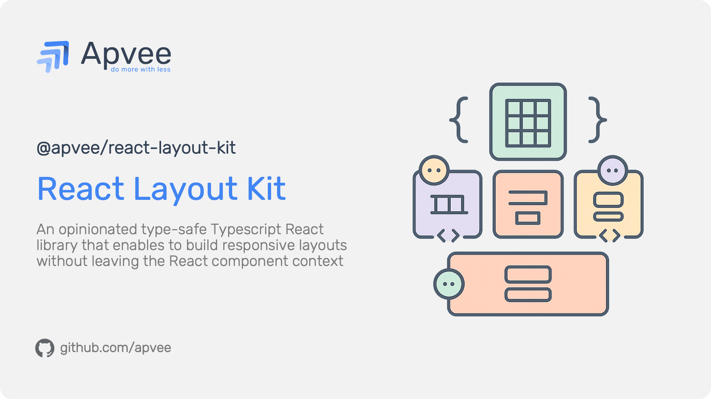

# @apvee/react-layout-kit

> A type-safe, responsive React layout library built with TypeScript and Emotion CSS. Simplifies layout creation with component-based styling and container-aware responsive design.



## Quick Overview

**@apvee/react-layout-kit** is an opinionated, type-safe React layout library that enables you to build responsive layouts without leaving the React component context. Built on TypeScript and Emotion CSS, it provides a comprehensive set of layout components with full CSS-in-JS capabilities, responsive prop support, and powerful composition patterns.

### Why @apvee/react-layout-kit?

- **Type Safety** - Full TypeScript support with IntelliSense for all CSS properties
- **Container-Aware** - JavaScript-driven responsive system that works with any container, not just viewport
- ** Performance** - Emotion CSS runtime optimization, debounced ResizeObserver, memoized calculations
- **Zero Config** - No CSS setup required; styles are generated from props
- **Customizable** - Breakpoints and spacing scales with module augmentation
- **Developer-Friendly** - Intuitive API with both full CSS and convenient shorthand
- **Composition** - `asChild` prop for seamless component composition

---

## Installation

```bash
npm install @apvee/react-layout-kit
```

```bash
yarn add @apvee/react-layout-kit
```

**Requires React 17.0.0+**

---

## Quick Start

```tsx
import { Box, Flex, Stack } from "@apvee/react-layout-kit";

function App() {
  return (
    <Box p={{ xs: "md", lg: "xl" }}>
      <Stack gap="lg">
        <Box $fontSize={32} $fontWeight="bold">
          Welcome to React Layout Kit
        </Box>

        <Flex direction={{ xs: "column", md: "row" }} gap="md" align="center">
          <Box $flex={1}>Responsive content</Box>
          <Box $flex={1}>Container-aware layout</Box>
        </Flex>
      </Stack>
    </Box>
  );
}
```

---

## Full Documentation

For complete documentation, guides, API reference, and examples, see:

**[Full Documentation](https://github.com/apvee/react-layout-kit/blob/main/docs/introduction.md)**

The complete documentation includes:

- **Core Concepts** - Responsive values, container-aware design, dollar/short props, spacing system
- **Layout Components** - Box, Flex, Grid, Stack, SimpleGrid, AreaGrid, Container, Center, AspectRatio, Group, Space, ScrollArea
- **Composition Primitives** - Slot, Slottable, useSlot
- **Hooks** - useElementWidth, useContainerWidth, useMergedRef
- **Utilities** - createStyles, mergeClasses, resolveSpacing, resolveResponsiveValue
- **Configuration** - Breakpoints, spacing scales, TypeScript module augmentation
- **Advanced Patterns** - Custom responsive components, complex layouts, polymorphic rendering
- **TypeScript Support** - Full type safety with custom type definitions
- **Migration Guides** - From CSS Modules, Styled Components, and other libraries
- **Troubleshooting** - Common issues and solutions

---

## Resources

- **[Storybook Demo](https://apvee.github.io/react-layout-kit/)** - Interactive component examples
- **[GitHub Repository](https://github.com/apvee/react-layout-kit)** - Source code and issues
- **[npm Package](https://www.npmjs.com/package/@apvee/react-layout-kit)** - Package information

---

## Contributing

Contributions are welcome! Please follow these guidelines:

1. Fork the repository
2. Create a feature branch (`git checkout -b feature/amazing-feature`)
3. Commit your changes (`git commit -m 'Add some amazing feature'`)
4. Push to the branch (`git push origin feature/amazing-feature`)
5. Open a Pull Request

### Development Setup

```bash
# Clone the repository
git clone https://github.com/apvee/react-layout-kit.git
cd react-layout-kit

# Install dependencies
npm install

# Run development mode with watch
npm run dev

# Run Storybook for component development
npm run storybook

# Build the library
npm run build

# Type check
npm run check
```

---

## License

MIT License

---

Made with ❤️ by [Apvee Solutions](https://github.com/apvee)
